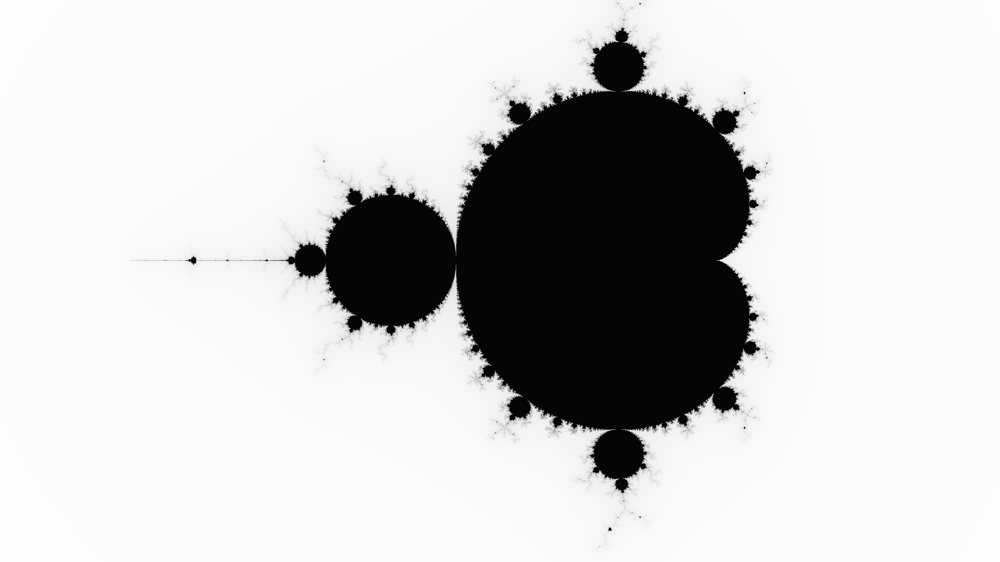

# Mandelbrot Set

Implementation of the Mandelbrot set in golang.

The result of the `mandelbrot.Mandelbrot` function with `setBeginX = -2.5`, `setBeginY = -1.0` and `stepSize = 0.002` for a 1920x1080 image:


The reslt of the `mandelbrot.Zoom` function with `setCenterX = -0.761574`, `setCenterY = -0.0847596`, `stepSizeBegin = 0.002`, `stepCoef = 0.9` for a 1920x1080 image with 120 frames:


## Installation
`go get github.com/agayev169/golang_examples/mandelbrot`

## Usage
```
package main

import (
	"github.com/agayev169/golang_examples/mandelbrot"
	"image/png"
	"os"
)

func main() {
	img := mandelbrot.Mandelbrot(1920, 1080, -2.5, -1.0, 0.002)

	f, err := os.Create("img.png")
	if err != nil {
		panic(err)
	}
	defer f.Close()
    
	png.Encode(f, img)
}
```

```
package main

import (
	"github.com/agayev169/golang_examples/mandelbrot"
	"image/gif"
	"os"
)

func main() {
	img := mandelbrot.Zoom(1920, 1080, -0.761574, -0.0847596, 0.002, 0.9, 120)

	f, err := os.Create("img.gif")
	if err != nil {
		panic(err)
	}
	defer f.Close()

	gif.EncodeAll(f, img)
}
```